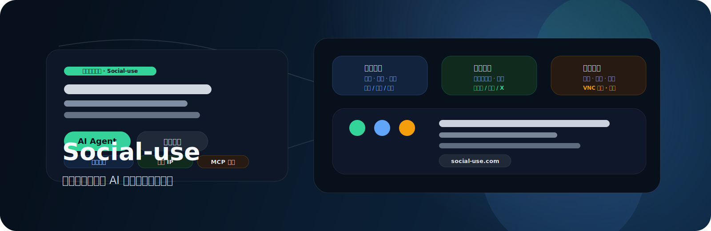
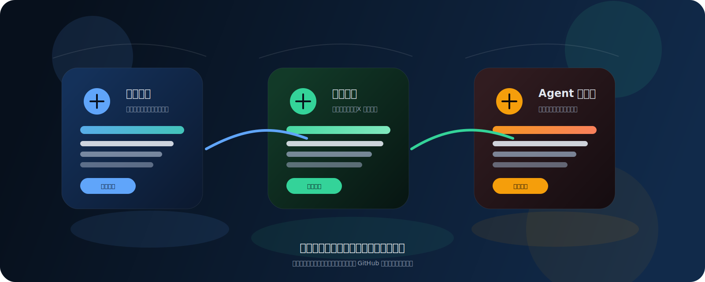
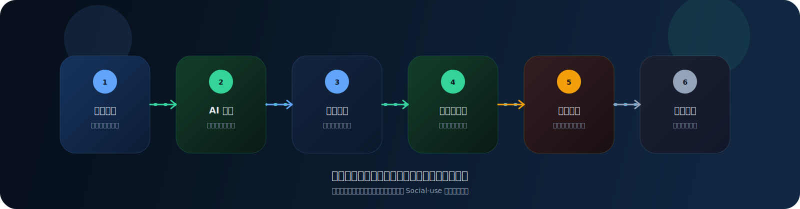

# Social-use

  

  

  

> Social-use is an AI social media operating platform for creators, brands, and teams.
> It brings content creation, publishing, multi-account management, engagement, and analytics into one workflow.

## What it is

Social-use is more than a posting tool and more than a chat-based AI.
It is an **AI social media operating system** designed to move social operations from manual execution to assisted automation.

If you need a tool that helps you create content, publish it, and keep operating after it goes live, Social-use is built for that job.

## Core capabilities

### Content creation

- Generate topics, titles, copy, and scripts with AI
- Rewrite content for platform-specific styles
- Reuse one idea across text, image, and video formats

### Multi-platform distribution

- Publish to multiple social platforms in one flow
- Schedule posts and run batch publishing
- Preview and review before publishing

### Multi-account operations

- Manage brand accounts, sub-accounts, and lead-gen accounts
- Assign different strategies by account role
- Fit for creators, brand teams, and content agencies

### Engagement and growth

- Manage comments, DMs, and user interactions
- Follow up on leads with automated workflows
- Track performance and optimize content direction

## Typical use cases

- Creators who want one idea to reach multiple platforms
- Brand teams that need centralized account operations
- Ecommerce teams connecting content with conversion
- Content agencies running repeatable publishing workflows
- Growth teams exploring AI-assisted social automation

## Why it is search-friendly

Social-use targets a tightly defined set of use cases and keywords:

- AI social media operating platform
- AI Agent for social operations
- multi-platform publishing tool
- multi-account management
- content generation and rewriting
- social media automation workflow
- comment and DM automation
- analytics-driven content optimization

## Product links

- Website: <https://social-use.com>
- Demo: <https://demo.social-use.com>

## Roadmap

- More powerful automation workflows
- Stronger review and risk controls
- Deeper growth and conversion loops
- A better operating layer for teams

## Brand message

Social-use is being built as the operating layer for modern social media teams.
The goal is to reduce repetitive work, keep content moving, and make growth easier to scale.

## SEO summary

Social-use is an AI social media management platform for creators, brands, ecommerce teams, content agencies, and growth teams.
It supports AI content generation, multi-platform publishing, multi-account management, engagement workflows, analytics, and social media automation.

  <a href="https://social-use.com">Website</a> ·
  <a href="https://demo.social-use.com">Demo</a> ·
  <a href="./README.zh.md">中文</a>

