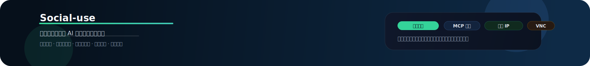

# Social-use

  

> Social-use 是一个面向中文社媒团队、MCN 机构、品牌营销团队和电商增长团队的 AI 社交媒体运营平台。
> 它把内容生成、多平台发布、多账号矩阵、互动运营、Agent 自动化和数据分析放进同一个工作流里。

## 这是什么

Social-use 不是单纯的排期发帖工具，也不是只生成文案的 AI。
它更像是一套 **AI 社媒运营中台**，帮助团队从“人工反复操作账号”升级为“人和 Agent 协作运营账号”。

适合这些关键词对应的场景：

- 社媒运营平台
- MCN 账号矩阵运营
- 多账号批量发布
- 小红书运营、抖音运营、短视频分发
- 品牌内容营销和种草投放
- 跨境社媒和海外账号运营
- AI Agent 自动化运营
- 指纹设备、纯净 IP、VNC 远程查看

## 核心能力

### 内容生产

- AI 生成选题、标题、文案、短视频脚本和图文笔记
- 针对小红书、抖音、Twitter/X、YouTube、TikTok 等平台改写风格
- 支持长文拆短文、视频转图文、中文内容翻译和多语言复用

### 发布分发

- 一份内容适配多个平台和多个账号
- 支持定时发布、批量发布、草稿保存和发布前预览
- 适合 MCN、内容工厂、品牌矩阵号和代运营团队

### 矩阵运营

- 统一管理品牌号、达人号、垂类号、引流号和测试号
- 按账号角色配置内容策略、发布频率和审核流程
- 支持团队协作、权限控制和高风险操作确认

### Agent 自动化

- 支持 Agent 通过 MCP 工具调用能力
- 支持指纹设备环境和纯净 IP 运行
- 支持 VNC 查看执行过程，方便人工确认和接管

### 互动增长

- 统一管理评论、私信、用户互动和潜在客户线索
- 支持自动回复、用户标签、私域转化和客服跟进场景
- 用数据分析内容表现、平台效果和下一步优化方向

## 产品示意

  

  

## 典型客户

1. MCN 和内容机构：需要批量生产内容、管理达人账号和提升分发效率
2. 品牌营销团队：需要统一管理品牌号、垂类号和活动账号
3. 电商和跨境团队：需要把内容发布、评论私信和转化线索连接起来
4. 自媒体创作者：需要把一个选题快速改写成多平台内容
5. AI 内容团队：需要构建可复制、可审核、可追踪的自动化运营流程

## SEO 关键词

AI 社交媒体运营平台、社媒运营工具、MCN 账号矩阵、矩阵号管理、多账号管理、多平台发布、批量发布工具、内容自动化、AI 内容生成、小红书运营、抖音运营、短视频运营、Twitter/X 自动发布、YouTube 内容分发、TikTok 运营、跨境社媒运营、品牌内容营销、电商内容运营、评论私信自动化、私域转化、Agent 自动化、MCP 工具、指纹设备、纯净 IP、VNC 远程查看。

## 产品入口

- 官网：<https://social-use.com>
- Demo：<https://demo.social-use.com>

## 未来方向

- 更强的 Agent 工作流编排
- 更完整的内容审核和账号风控
- 更深的评论私信转化链路
- 面向 MCN 和品牌团队的运营协作中台

  <a href="https://social-use.com">Website</a> ·
  <a href="https://demo.social-use.com">Demo</a> ·
  <a href="./README.en.md">English</a>

